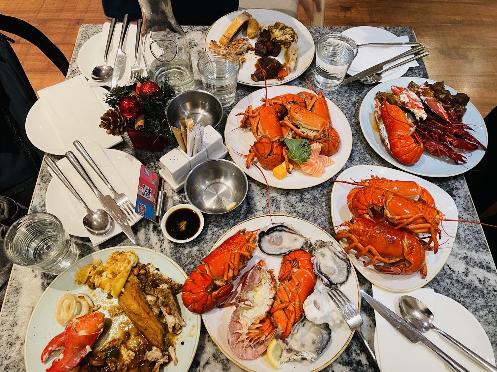

---

  

    Selected Honors and Awards
  

  

    <ul>
      <li>Finalist, POMS-HK Best Student Paper Award Competition, 2025</li>
      <li>Third Prize, CSAMSE Best Paper Award Competition, 2023</li>
      <li>NUS Research Scholarship, 2020-2024</li>
    </ul>
  

 

  

     More About Me
  

  

    <ul>
      <li>I was born in Fushun, Liaoning, located in the northeast region of China.</li>
      <li>During my PhD period, two of my friends are absolutely buffet killers (names upon request). Under their strict requirements and dedicated guidance, I am also on my way to becoming a buffet legend!</li>
      <li> I enjoy being in the kitchen; cooking relaxes me. I'm confident I can make delicious dishes on my first try.</li>
      <li> In my daily life, I enjoy eating healthy food, but I also love spicy hot pot.</li>
      <li> Since 2023, I have been consistently doing strength training.</li>
    </ul>
  

    
    
    
    
    
  

  
<!--
 

- I was born in Fushun, Liaoning, located in the northeast region of China.
- During my PhD period, two of my friends are absolutely buffet killers (names upon request). Under their strict requirements and dedicated guidance, I am also on my way to becoming a buffet legend!
- I enjoy being in the kitchen; cooking relaxes me. I'm confident I can make delicious dishes on my first try.
- In my daily life, I enjoy eating healthy food, but I also love spicy hot pot.
- Since 2023, I have been consistently doing strength training (although there are still no very obvious signs of it yet...).

-->

<!--
 

- I was born in Fushun, Liaoning, located in the northeast region of China.
- During my PhD period, two of my friends are absolutely buffet killers (names upon request). Under their strict requirements and dedicated guidance, I am also on my way to becoming a buffet legend!
- I enjoy being in the kitchen; cooking relaxes me. I'm confident I can make delicious dishes on my first try.
- In my daily life, I enjoy eating healthy food, but I also love spicy hot pot.
- Since 2023, I have been consistently doing strength training (although there are still no very obvious signs of it yet...).

-->
